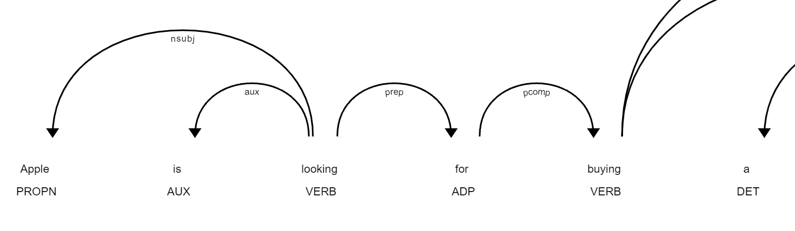
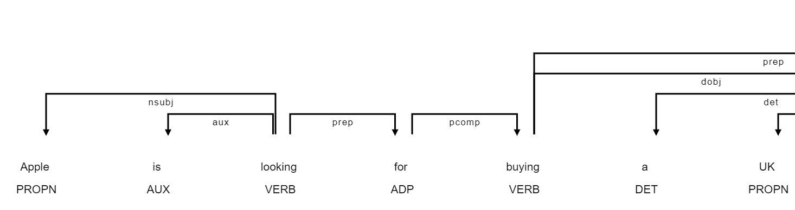
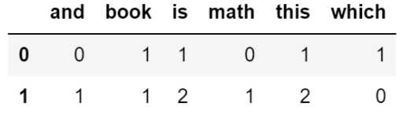
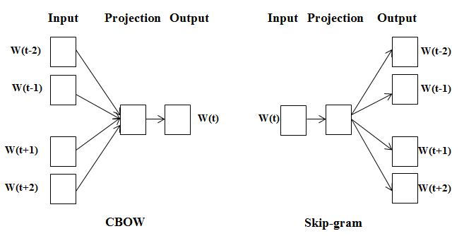
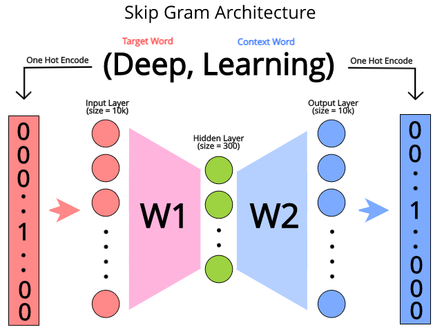
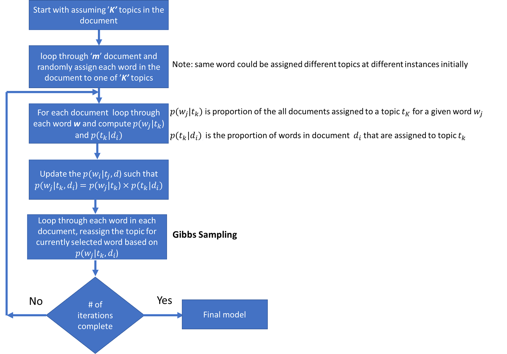
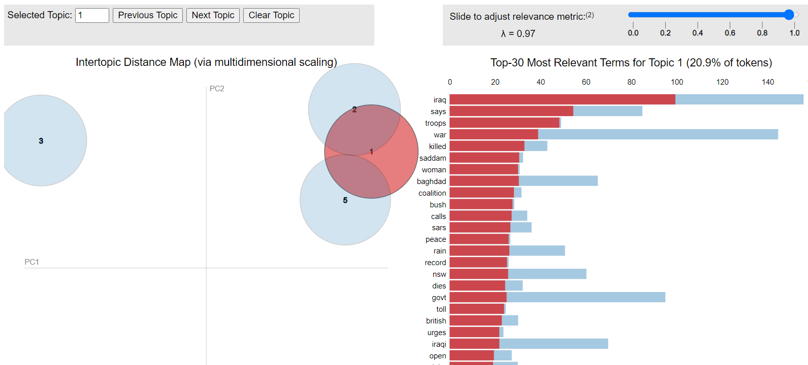

## NLP beginner

### 1. NLP基本流程和Spacy框架

NLP（自然语言处理）是深度学习中一门重要应用，NLP主要涉及到和人类语言相关的研究和应用，一直以来都有种说法，语言理解是人工智能皇冠上的明珠，这说明NLP在AI领域的地位十分重要，同时也说明NLP的研究一直是相对比较困难的，近年来随着算力的巨大提升和深度学习模型的发展（尤其是transformer技术），NLP领域也产生了巨大的进步。

本教程将以开源框架spacy为基础（此外还有其他开源框架如NLTK, gensim），开始一份针对零基础的NLP入门学习材料。

一个基本的NLP流程包括数据收集-文本规范化-特征提取-模型算法。本章首先将介绍spacy的使用，以及如何用spacy进行文本规范化操作。

#### 1.1 spacy安装

spacy库的安装分为两步，首先第一步是安装库本身

```shell
pip install spacy
```

第二步是安装预训练模型，预训练模型是根据其他语料数据事先训练好的pipeline，用户可以直接用来推断新数据。以英语为例，官方提供了四种预训练模型（https://spacy.io/models/en），分别从小到大的en_core_web_sm，en_core_web_md，en_core_web_lg和新引入的包含transformer的en_core_web_trf。在国内由于网络的原因，无法直接安装，需要首先去github上下载对应版本的压缩包（https://github.com/explosion/spacy-models/releases/tag/en_core_web_sm-3.1.0），然后本地安装。

```shell
pip install en_core_web_sm-3.1.0.tar.gz 
```

#### 1.2 spacy工作流程

spacy的基本工作流程可以用这张官网的图来概括，spacy接收一段文本作为输入，输出为Doc的对象格式，其中Doc是由一系列的token序列组成，每个token上都附加了一些标注，标注的内容由中间的步骤的pipeline component决定。在spacy的处理过程，总是先进行tokenizer，这一步做的是将文本拆分成最小元素的token，之后进行文本预处理。对于文本预处理的过程，用户可以自定义搭配组件，也可以使用默认组件。


下面简单介绍一些常用的组件：

| 名称           | 组件                                                        | 作用                                                         |
| -------------- | ----------------------------------------------------------- | ------------------------------------------------------------ |
| **tagger**     | [`Tagger`](https://spacy.io/api/tagger)                     | Assign part-of-speech tags.（词性标注）                      |
| **parser**     | [`DependencyParser`](https://spacy.io/api/dependencyparser) | Assign dependency labels.（依存分析，文本中的token依存关系） |
| **ner**        | [`EntityRecognizer`](https://spacy.io/api/entityrecognizer) | Detect and label named entities.（命名实体识别，标注token类型） |
| **lemmatizer** | [`Lemmatizer`](https://spacy.io/api/lemmatizer)             | Assign base forms.（词形还原，如was还原为be）                |

#### 1.3 spacy基本使用

通过代码进一步了解以上的处理流程是如何工作的。

```python
import spacy
```


```python
# 导入预训练模型
nlp = spacy.load('en_core_web_sm')
```


```python
# 查看默认的pipeline包含哪些组件
nlp.pipeline
```


    [('tok2vec', <spacy.pipeline.tok2vec.Tok2Vec at 0x1f38d34de00>),
     ('tagger', <spacy.pipeline.tagger.Tagger at 0x1f3920bcdb0>),
     ('parser', <spacy.pipeline.dep_parser.DependencyParser at 0x1f391f25ee0>),
     ('attribute_ruler',
      <spacy.pipeline.attributeruler.AttributeRuler at 0x1f3920eee40>),
     ('lemmatizer', <spacy.lang.en.lemmatizer.EnglishLemmatizer at 0x1f39211b980>),
     ('ner', <spacy.pipeline.ner.EntityRecognizer at 0x1f3920992e0>)]

**解析文本，输出doc**


```python
text = 'Apple is looking for buying a UK startup for $1 billion'
```


```python
doc = nlp(text)
```

**tokenizer**

这一步是输入文本是如何被拆分成token单元的。


```python
for token in doc:
    print(token.text)
```

    Apple
    is
    looking
    for
    buying
    a
    UK
    startup
    for
    $
    1
    billion

**POS**

这一步是查看每个token的词性


```python
for token in doc:
    print(f'{token.text:{15}} {token.pos_:}')
```

    Apple           PROPN
    is              AUX
    looking         VERB
    for             ADP
    buying          VERB
    a               DET
    UK              PROPN
    startup         NOUN
    for             ADP
    $               SYM
    1               NUM
    billion         NUM

**Dependency**

这一步是查看句子中token的依存关系，下面图示的箭头表示依存方向


```python
from spacy import displacy
```


```python
displacy.render(doc,style='dep')
```



```python
# 更紧密的显示方式
displacy.render(doc,style='dep',options={'distance':150,'compact':True})
```



**NER**

这一步是查看token的命名实体，注意不是所有token都有类别的。


```python
for ent in doc.ents:
    print(ent.text, ent.label_)
```

    Apple ORG
    UK GPE
    $1 billion MONEY

```python
displacy.render(doc,style='ent')
```


**Lemmatizer**

这一步是查看每个token的词根还原。


```python
for token in doc:
    print(f'{token.text:{15}} {token.lemma_}')
```

    Apple           Apple
    is              be
    looking         look
    for             for
    buying          buy
    a               a
    UK              UK
    startup         startup
    for             for
    $               $
    1               1
    billion         billion

**sentence segmentation**

这一步是查看如何拆分句子的。


```python
text = 'Apple is looking for buying a UK startup. Government has given permission'
```


```python
doc=nlp(text)
```


```python
for sent in doc.sents:
    print(sent)
```

    Apple is looking for buying a UK startup.
    Government has given permission
#### 1.4 spacy pipeline技巧

出于效率考虑，有一些spacy的使用小技巧：

- 以batch的形式处理一系列文本，而不是对每一段文本一步步处理，可以用到 `nlp.pipe`方法调用，会以迭代器的方式输出结果。这有点像神经网络训练过程中的batch training。
- 只应用需要的pipeline组件，或对某些组件使用disable，这也可以加快文本的解析速度。

下面这个例子展示了如何应用这两个技巧。

```python
texts = ['net income was $9.4 million compared to the prior year of 2.7$ million',
        'revenue exceeds twelve billion dollars with a loss of $1b']
```


```python
docs = nlp.pipe(texts, disable = ['tagger', 'parser','lemmatizer'])

for doc in docs:
    for ent in doc.ents:
        print(ent.text, ent.label_)
    print()
```

    $9.4 million MONEY
    the prior year DATE
    2.7$ million MONEY
    
    twelve billion dollars MONEY
    1b MONEY


### 2. NLP文本预处理

NLP领域有许多常见的应用，如文本分类，文本摘要，文本聚类等，在最文本进行算法建模之前，都会经常统一的文本预处理过程，处理过后再将数据送入模型进行训练。本节将重点介绍预处理部分，文本预处理和常规结构化的机器学习数据不太一样，有一些特殊的方法。一般预处理又分为两部分，文本规范化处理和特征提取。

文本规范化处理有许多种方法，在实践中会依据语料，语言种类和任务的不同选择合适的方式组合。

常见的规范化方式有以下这些：

- 分词

- 大小写统一
- 标点符号去除
- 去除停用词
- 变形标准化
- 中文繁简转换
- 拼写纠错

特征提取是文本数据分析的重要部分，由于模型无法直接处理大段的文本数据，因此需要首先将文本转化成向量的形式，也被称作向量空间模型，也称为词向量模型，该模型将文本转化成一个长度为n的长向量，长向量中的每一个元素表示某个特定词或词组的权重，因此这样转换过后就可以被模型读取了。在词向量模型中又三种主要的模型，分别是：

- 词袋模型
- TF-IDF模型
- 高级词向量模型

#### 2.1 词袋模型

词袋模型(bag of words)是所有词向量模型中最简单，也最易于理解的一种，它用文档中出现的所有词汇的次数来表示一组词向量。因此在词袋模型中，向量的长度就是整个训练语料库的总词汇数。随着总词汇数的增加，产生的词向量会变成一个巨大的稀疏矩阵，这也对计算量是一个挑战，此外词袋模型只考虑了词汇频数信息，没有考虑词汇的位置信息。

通过一个例子看一下词袋模型中是如何表示文本的。

例如有这样一个文本数据，包含两个样本

x = ['which book is this', 'this is book and this is math']

整个语料库总共6个不同的词汇，变成6个特征列，对于每个样本分别计算每个特征列词汇出现的次数作为该列的值。



sklearn包提供了封装好的接口，下面就以某个文本分类数据集来实战如何使用词袋模型。

**API使用**

导入数据

```python
from sklearn.feature_extraction.text import CountVectorizer
import pandas as pd
```

```python
df = pd.read_csv('../data/spam.tsv', sep = '\t')
df.head()
```

查看数据

<table border="1" class="dataframe">
  <thead>
    <tr style="text-align: right;">
      <th></th>
      <th>label</th>
      <th>message</th>
      <th>length</th>
      <th>punct</th>
    </tr>
  </thead>
  <tbody>
    <tr>
      <th>0</th>
      <td>ham</td>
      <td>Go until jurong point, crazy.. Available only ...</td>
      <td>111</td>
      <td>9</td>
    </tr>
    <tr>
      <th>1</th>
      <td>ham</td>
      <td>Ok lar... Joking wif u oni...</td>
      <td>29</td>
      <td>6</td>
    </tr>
    <tr>
      <th>2</th>
      <td>spam</td>
      <td>Free entry in 2 a wkly comp to win FA Cup fina...</td>
      <td>155</td>
      <td>6</td>
    </tr>
    <tr>
      <th>3</th>
      <td>ham</td>
      <td>U dun say so early hor... U c already then say...</td>
      <td>49</td>
      <td>6</td>
    </tr>
    <tr>
      <th>4</th>
      <td>ham</td>
      <td>Nah I don't think he goes to usf, he lives aro...</td>
      <td>61</td>
      <td>2</td>
    </tr>
  </tbody>
</table>


```python
# 原始数据集形状，总共5572个样本
df.shape
```

```
(5572, 4)
```

```python
# 创建词袋模型实例
vectorizer = CountVectorizer()
X = vectorizer.fit_transform(df['message'])
```

```python
# 使用词袋模型后，每个样本文本被扩展为长度为8713的向量
X.shape
```

```
(5572, 8713)
```

```python
# 直接得到的X为有利于存储的稀疏矩阵格式
X
```

```
<5572x8713 sparse matrix of type '<class 'numpy.int64'>'
	with 74169 stored elements in Compressed Sparse Row format>
```

```python
# 如果想查看数值可以使用toarray函数
X.toarray()
```

```
array([[0, 0, 0, ..., 0, 0, 0],
       [0, 0, 0, ..., 0, 0, 0],
       [0, 0, 0, ..., 0, 0, 0],
       ...,
       [0, 0, 0, ..., 0, 0, 0],
       [0, 0, 0, ..., 0, 0, 0],
       [0, 0, 0, ..., 0, 0, 0]], dtype=int64)
```

```python
# get_feature_names函数查看自动产生的全部特征列
vectorizer.get_feature_names()[1000:1010]
```

```
['ahhhh',
 'ahmad',
 'ahold',
 'aid',
 'aids',
 'aig',
 'aight',
 'ain',
 'aint',
 'air']
```

**探索CountVectorizer的参数**

列举一些常用的参数： 
`stop_words` : 如果是英文预料，可以直接赋值'english'使用内置停用词, 如果是中文，可以赋值一个停用词列表，默认值为None 
`ngram_range`：格式为元组（min_n, max_n)，默认值为（1,1）表示只考虑单个词，（1,2）则表示2个词的词组也会被加入到词向量中 
`max_df, min_df`：这两个参数类似，可以输入一个0到1之间的浮点数，或整数，表示过滤掉出现在所有文档中出现频率过高或过低的词汇 
`binary`：默认为False，如果设为True，则所有出现的词汇数量都变成1，而不是实际出现的次数

```python
vectorizer = CountVectorizer(ngram_range=(1,2),stop_words='english',max_df=0.8,min_df=0)
X = vectorizer.fit_transform(df['message'])
```

```python
X.shape
```

```
(5572, 37364)
```

由于包含了2元词组，词向量变长了

**关于中文词向量**

由于sklearn包中的词向量模型主要是针对英文设计的，英文在每个单词之间都会有空格，因此可以直接调用，但是对于中文这种不加空格的语言，则需要多加一步分词的操作。关于中文分词，已经有很多优秀的扩展包，这里使用了jieba库。思路是先对中文文本进行分词，再以空格连接，模拟成英文的写法 ，然后再运行词袋模型。

```python
import jieba
```

```python
df= pd.DataFrame({'text':['小明毕业于上海交通大学','李华在新华书店上班']})
```

```python
df['text_split'] = df['text'].apply(lambda x: " ".join(jieba.cut(x,cut_all=False)))
df['text_split_cutall'] = df['text'].apply(lambda x: " ".join(jieba.cut(x,cut_all=True)))
```

<table border="1" class="dataframe">
  <thead>
    <tr style="text-align: right;">
      <th></th>
      <th>text</th>
      <th>text_split</th>
      <th>text_split_cutall</th>
    </tr>
  </thead>
  <tbody>
    <tr>
      <th>0</th>
      <td>小明毕业于上海交通大学</td>
      <td>小明 毕业 于 上海交通大学</td>
      <td>小 明 毕业 于 上海 上海交通大学 交通 大学</td>
    </tr>
    <tr>
      <th>1</th>
      <td>李华在新华书店上班</td>
      <td>李华 在 新华书店 上班</td>
      <td>李 华 在 新华 新华书店 书店 上班</td>
    </tr>
  </tbody>
</table>
关于jieba分词的函数，我们使用了两种模式，全模式（cut_all=True）和精确模式，在全模式下所有可能的组合都会出现在分词结果中，从这个例子中可以观察具体区别。


#### 2.2 TD-IDF

在上一节讲解了如何计算词袋模型以及API在中英文预料上的使用，词袋模型有一个问题是仅仅考虑了单词出现的绝对频率，但这并不表示这些词汇对于预测这篇文本是有效的，例如有些虚词可能在几乎所有文档中都会出现，单纯考虑这些词汇的词频并不能有效区分不同类型的文本，因此在这一节我们要引入词频-逆文档频率(Term Frequency - Inverse Document Frequency，TF-IDF)。

数学上tfidf是两个度量的乘积，表示为tf和idf。词频tf和上一节词袋模型中的计算完全相同，用来表示词汇在该文档中出现的频率。逆文档频率idf表示每个单词的文档频率的逆，也就是语料库中全部文档数量除以单词在全部文档中出现的频率，公式表示为
$$
idf(t) = 1+log\frac{C}{1+df(t)}
$$
C表示语料库总数量，df(t)表示包含单词t的文档数量，其中对数中的分母加1为了避免出现分母为0的情况，idf总体加1为了避免被忽略单词得到的idf值为0。

最终的tfidf向量表示为
$$
tfidf= \frac{tf*idf}{||tfidf||}
$$
也就是在tfidf矩阵的基础上除以L2范数归一化。

和词袋模型类似，sklearn中提供了现成的接口直接调用（https://scikit-learn.org/stable/modules/generated/sklearn.model_selection.train_test_split.html）。

下面以同样的样例数据集展示极简的使用流程。

**导入包和数据**


```python
from sklearn.feature_extraction.text import TfidfVectorizer
from sklearn.model_selection import train_test_split
from sklearn.ensemble import RandomForestClassifier
from sklearn.metrics import confusion_matrix
```


```python
df = pd.read_csv('../data/spam.tsv', sep = '\t')
```

**划分数据集**


```python
X_train, X_test, y_train, y_test = train_test_split(df['message'], df['label'], test_size = 0.2, random_state = 0, stratify = df['label'])
```

**实例化tfidf，变换数据**


```python
vectorizer= TfidfVectorizer()
tf_x_train = vectorizer.fit_transform(X_train)
tf_x_test = vectorizer.transform(X_test)
```

**查看转换后的矩阵**


```python
tf_x_train.toarray().shape
```


    (4457, 7708)

**应用模型**


```python
clf = RandomForestClassifier()
clf.fit(tf_x_train, y_train)
```

**打印结果**


```python
y_pred = clf.predict(tf_x_test)
```


```python
confusion_matrix(y_test, y_pred)
```


    array([[966,   0],
           [ 27, 122]], dtype=int64)


#### 2.3 高级词向量模型（word2vec、Glove）

上一节介绍了两种基本的词向量模型，分别是词袋模型和TF-IDF，这些方法有一个明显的缺点是没有考虑语境，也就是单词在文本中出现的顺序，上下文环境完全没有计算进来，有一定的局限性。今天我们来学习一些高级词向量模型-word2vec和Glove。

这两种词向量模型都可以认为是一种预训练方法，词向量的产生需要利用大量语料数据进行训练，对算力要求很高，常规使用时直接用别人训练好的模型结果即可。

这两种词向量模型使用了不同的训练方法，分别是基于神经网络的监督学习和基于矩阵分解的非监督学习。

word2vec算法最早由谷歌的研究人员发布，用到一个简单的前馈神经网络进行训练，并且可以进一步细分为两种训练思路skip-gram和CBOW (Continuous Bag of Words) 。

用一个例子说明这两种方式的区别。考虑这么一段文本，deep learning is very hard。skip-gram是用target word作为输入去预测context word，在这个文本例子中就是输入is，预测is的上下文deep learning和very hard。而CBOW刚好反过来，用context word去预测target word，也就是输入上下文deep learning和very hard，预测中间的目标is。

下图清晰地展示了两种方式的区别，除此之外这两种方式没有其他区别。




神经网络的训练过程可以用另一个结构图来描述，对于输入输出我们都用one-hot的方式转换成一个巨大的词汇向量（示例图中是10K），输入层和输出层之间是一个隐层，隐层向量就是我们希望得到的词向量，示例图中长度是300，也就是我们可以用一个长度仅仅为300的向量来表示语料库中的每个单词，这对于词袋模型是一个巨大的进步。



并且这种高级词向量模型是包含语义信息的，计算词向量的夹角可以表示两个单词的相似度，相似度越大夹角越小。举两个经典的例子，king - man + woman ≈ queen，Berlin-Germany+France=Paris，这都体现了word2vec是能体现语义信息的，通过词向量的加减可以反映出单词的含义。

Glove是由斯坦福大学的研究人员最先发布的，它的优点和word2vec几乎一样，同样能体现语义信息，最大的区别在于训练方式不同，Glove的全称是global vector，根据原始论文的说法是，glove的计算过程考虑到了全局的统计信息，计算Glove词向量时，首先计算出一张全局的词汇共现矩阵，也就是不同单词同时出现的次数，再根据论文中的计算方式分解后得到词汇的特征向量。

下面通过代码实战学习如何使用预训练的词向量模型应用到自己的数据上，这里只展示如何将文本转换为词向量，文本分类的训练过程和上一节类似。


**word2vec**

我们使用spacy库中的word2vec进行词向量转换，首先在spacy官网下载en_core_web_lg语料库并加载

```python
import spacy
nlp = spacy.load('en_core_web_lg')
nlp('deep learning is very hard').vector.shape
```


```python
# 词向量长度为300
(300,)
```


```python
df = pd.read_csv('../data/spam.tsv', sep = '\t')
```

vector方法将token转换为词向量


```python
df['vector'] = df['message'].apply(lambda x: nlp(x).vector)
```


**Glove**

在斯坦福网站下载glove词向量模型，https://nlp.stanford.edu/projects/glove/，简单使用可以下载glove.6B.zip这个版本。


```python
import numpy as np
glove_vectors = dict()
```


```python
# 将下载后的压缩包解压，会看到多个文件分别代表不同长度的词向量，文件名结尾的100d就表示这个文件记录的是长度为100的词向量
file = open('../glove/glove.6B.100d.txt', encoding='utf-8')

for line in file:
    values = line.split()
    
    word  = values[0]
    vectors = np.asarray(values[1:])
    glove_vectors[word] = vectors
    
file.close()
```

查看向量长度


```python
glove_vectors.get('king').shape
```


    (100,)

对文本数据进行词向量转换，将每段文本拆分成token后，将词向量加和。


```python
vec_shape=100
def get_vec(x):
    arr = np.zeros(vec_shape)
    text = str(x).split()
    
    for t in text:
        try:
            vec = glove_vectors.get(t).astype(float)
            arr = arr + vec
        except:
            pass
        
    arr = arr.reshape(1, -1)[0]
    return arr/len(text)
```


```python
df['vector1'] = df['message'].apply(lambda x: get_vec(x))
```


### 3. 文本摘要

文本摘要是NLP领域的一个重要分支，文本摘要的需求来源于信息过载，在互联网时代，信息获取变得越来越容易和快捷，但同时也产生了信息过载的问题，当我们面对大量信息时，如何从中抽取最有价值的部分，于是产生了一系列的文本摘要技术，文本摘要简化了我们在更短时间内做出良好决策的过程。

文本摘要中最流行的技术包括以下几种，关键短语提取(key phrase extraction)，主题建模(topic modeling)和自动文档摘要(automated document summarization)。

关键短语提取最简单，涉及从包含其主要概念或主题的文本文档或语料库中提取关键字或短语。

主题建模涉及使用统计和数据建模技术从文档语料库中提取核心主题，题材或概念。

自动文档摘要基于统计和机器学习技术来概括文档。

这三种思路从简单到复杂，这一节就先从主题建模开始说起。

####  3.1 主题建模

主题建模是一种无监督学习的形式，可以识别数据中的隐藏关系。作为无监督学习算法，主题建模不需要标记的数据。它可以直接应用于一组文本文件以提取信息。主题建模通常以探索性的方式工作，寻找一组文本数据中的主题。

主题建模是理解非结构化文本文档集合的一种通用方法。它可以用来自动化筛选大量文本数据，并帮助组织和理解它。一旦发现了关键的主题，就可以对文本文件进行分组，以便进一步分析。

主题建模有着广泛的应用，例如自动打标签，内容推荐，搜索引擎优化(SEO)。有许多算法都可以应用于主题建模中，常见的有潜在语义索引Latent Semantic Indexing，潜在狄利克雷分配latent Dirichlet allocation，非负矩阵分解Nonnegative Matrix Factorization。本节将重点介绍其中一种，latent Dirichlet allocation，缩写为LDA。

LDA的主要思想是，一个文档是一系列主题的组合，每个主题是一系列词的组合。所以LDA的训练过程涉及到两个概率，文档d中的词被分配到主题t的概率，以及主题t被分配到所有文档的概率。在训练时，LDA对每个词进行迭代，并试图将其分配给最佳主题。

LDA的训练过程可以用以下流程图来表示，



具体的计算过程较为复杂，简单说明下这个过程。

第一步是随机对所有文档中的所有单词指定一个主题，在指定完之后我们得到了两个概率，主题频率（每个文档中的主题分布，考虑单篇文档的局部统计量）和词汇频率（每个主题中的使用词汇分布，考虑全部文档的全局统计量），在后面的迭代过程会用到。

第二步开始对单个词汇进行主题的再分配，根据上一步得到的两个概率相乘，找到对于某个词汇结果最大的主题，将找到的新主题再分配给这个词汇。

第三步重复上一步的操作，对所有文档中的所有词汇都进行一次主题再分配，完成一轮迭代。

第四步重复上面的迭代过程，进行多轮迭代。

最后我们来看如何在python中使用LDA进行主题建模，sklearn和genism包中都内置了LDA算法，这里选择sklearn。

**引入包，导入数据**


```python
import pandas as pd
import numpy as np
from sklearn.feature_extraction.text import TfidfVectorizer
from sklearn.decomposition import LatentDirichletAllocation

data = pd.read_csv('../data/abcnews-date-text.csv', error_bad_lines=False, nrows=10000);
documents_list= data['headline_text'].tolist()  #选择文本列转成列表
```

**数据准备**


```python
# 定义一个TFIDF对象
tfidf = TfidfVectorizer(lowercase=True,
                        stop_words='english',
                        ngram_range = (1,1),
                       min_df=10)

# 将文档转换为词向量
train_data = tfidf.fit_transform(documents_list)   
```

**训练LDA模型**


```python
# 定义总共的主题数
num_components=5

# 创建LDA模型对象
model=LatentDirichletAllocation(n_components=num_components)

# 在词向量上训练
lda_matrix = model.fit_transform(train_data)

# 获取分主题的结果 
lda_components=model.components_
```

**打印结果**


```python
# 对每个主题的分组，打印这一主题前7的词汇
terms = tfidf.get_feature_names()

for index, component in enumerate(lda_components):
    zipped = zip(terms, component)
    top_terms_key=sorted(zipped, key = lambda t: t[1], reverse=True)[:7]
    top_terms_list=list(dict(top_terms_key).keys())
    print("Topic "+str(index)+": ",top_terms_list)
```

    Topic 0:  ['war', 'plan', 'iraq', 'anti', 'baghdad', 'protest', 'iraqi']
    Topic 1:  ['water', 'new', 'govt', 'hospital', 'wa', 'concerns', 'car']
    Topic 2:  ['world', 'cup', 'council', 'group', 'clash', 'funds', 'denies']
    Topic 3:  ['iraq', 'says', 'troops', 'war', 'killed', 'saddam', 'baghdad']
    Topic 4:  ['man', 'police', 'charged', 'death', 'court', 'face', 'missing']

```python
# 查看每篇文本的主题分布
columns = [f'P(topic {i+1})' for i in range(len(model.components_))]
df_result = pd.DataFrame(lda_matrix, columns=columns)
df_result.head()
```


<table border="1" class="dataframe">
  <thead>
    <tr style="text-align: right;">
      <th></th>
      <th>P(topic 1)</th>
      <th>P(topic 2)</th>
      <th>P(topic 3)</th>
      <th>P(topic 4)</th>
      <th>P(topic 5)</th>
    </tr>
  </thead>
  <tbody>
    <tr>
      <th>0</th>
      <td>0.598614</td>
      <td>0.100001</td>
      <td>0.101293</td>
      <td>0.100091</td>
      <td>0.100001</td>
    </tr>
    <tr>
      <th>1</th>
      <td>0.596681</td>
      <td>0.102181</td>
      <td>0.101136</td>
      <td>0.100001</td>
      <td>0.100001</td>
    </tr>
    <tr>
      <th>2</th>
      <td>0.083036</td>
      <td>0.083305</td>
      <td>0.083030</td>
      <td>0.667600</td>
      <td>0.083030</td>
    </tr>
    <tr>
      <th>3</th>
      <td>0.328767</td>
      <td>0.056390</td>
      <td>0.058485</td>
      <td>0.055470</td>
      <td>0.500888</td>
    </tr>
    <tr>
      <th>4</th>
      <td>0.446968</td>
      <td>0.067111</td>
      <td>0.067682</td>
      <td>0.071626</td>
      <td>0.346613</td>
    </tr>
  </tbody>
</table>


**可视化**

pyLDAvis包还提供了交互式的可视化方式

```python
import pyLDAvis
import pyLDAvis.sklearn
```


```python
# 直接读取sklearn模型
ldavis= pyLDAvis.sklearn.prepare(model, train_data, tfidf)
```


```python
# 保存为本地html
pyLDAvis.save_html(ldavis, 'ldavis.html')
```




### 参考文献

https://medium.com/analytics-vidhya/word-embeddings-in-nlp-word2vec-glove-fasttext-24d4d4286a73

https://towardsdatascience.com/light-on-math-ml-intuitive-guide-to-understanding-glove-embeddings-b13b4f19c010

https://www.mygreatlearning.com/blog/understanding-latent-dirichlet-allocation/

https://highdemandskills.com/topic-modeling-intuitive/

​                                                                                                                                                                                                                                                                                                                                                                                                                                