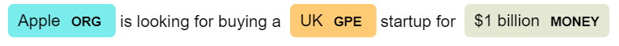

## NLP beginner

### 1. NLP基本流程和Spacy框架

NLP（自然语言处理）是深度学习中一门重要应用，NLP主要涉及到和人类语言相关的研究和应用，一直以来都有种说法，语言理解是人工智能皇冠上的明珠，这说明NLP在AI领域的地位十分重要，同时也说明NLP的研究一直是相对比较困难的，近年来随着算力的巨大提升和深度学习模型的发展（尤其是transformer技术），NLP领域也产生了巨大的进步。

本教程将以开源框架spacy为基础（此外还有其他开源框架如NLTK, gensim），开始一份针对零基础的NLP入门学习材料。

一个基本的NLP流程包括数据收集-文本规范化-特征提取-模型算法。本章首先将介绍spacy的使用，以及如何用spacy进行文本规范化操作。

#### 1.1 spacy安装

spacy库的安装分为两步，首先第一步是安装库本身

```shell
pip install spacy
```

第二步是安装预训练模型，预训练模型是根据其他语料数据事先训练好的pipeline，用户可以直接用来推断新数据。以英语为例，官方提供了四种预训练模型（https://spacy.io/models/en），分别从小到大的en_core_web_sm，en_core_web_md，en_core_web_lg和新引入的包含transformer的en_core_web_trf。在国内由于网络的原因，无法直接安装，需要首先去github上下载对应版本的压缩包（https://github.com/explosion/spacy-models/releases/tag/en_core_web_sm-3.1.0），然后本地安装。

```shell
pip install en_core_web_sm-3.1.0.tar.gz 
```

#### 1.2 spacy工作流程

spacy的基本工作流程可以用这张官网的图来概括，spacy接收一段文本作为输入，输出为Doc的对象格式，其中Doc是由一系列的token序列组成，每个token上都附加了一些标注，标注的内容由中间的步骤的pipeline component决定。在spacy的处理过程，总是先进行tokenizer，这一步做的是将文本拆分成最小元素的token，之后进行文本预处理。对于文本预处理的过程，用户可以自定义搭配组件，也可以使用默认组件。


下面简单介绍一些常用的组件：

| 名称           | 组件                                                        | 作用                                                         |
| -------------- | ----------------------------------------------------------- | ------------------------------------------------------------ |
| **tagger**     | [`Tagger`](https://spacy.io/api/tagger)                     | Assign part-of-speech tags.（词性标注）                      |
| **parser**     | [`DependencyParser`](https://spacy.io/api/dependencyparser) | Assign dependency labels.（依存分析，文本中的token依存关系） |
| **ner**        | [`EntityRecognizer`](https://spacy.io/api/entityrecognizer) | Detect and label named entities.（命名实体识别，标注token类型） |
| **lemmatizer** | [`Lemmatizer`](https://spacy.io/api/lemmatizer)             | Assign base forms.（词形还原，如was还原为be）                |

#### 1.3 spacy基本使用

通过代码进一步了解以上的处理流程是如何工作的。

```python
import spacy
```


```python
# 导入预训练模型
nlp = spacy.load('en_core_web_sm')
```


```python
# 查看默认的pipeline包含哪些组件
nlp.pipeline
```


    [('tok2vec', <spacy.pipeline.tok2vec.Tok2Vec at 0x1f38d34de00>),
     ('tagger', <spacy.pipeline.tagger.Tagger at 0x1f3920bcdb0>),
     ('parser', <spacy.pipeline.dep_parser.DependencyParser at 0x1f391f25ee0>),
     ('attribute_ruler',
      <spacy.pipeline.attributeruler.AttributeRuler at 0x1f3920eee40>),
     ('lemmatizer', <spacy.lang.en.lemmatizer.EnglishLemmatizer at 0x1f39211b980>),
     ('ner', <spacy.pipeline.ner.EntityRecognizer at 0x1f3920992e0>)]

**解析文本，输出doc**


```python
text = 'Apple is looking for buying a UK startup for $1 billion'
```


```python
doc = nlp(text)
```

**tokenizer**

这一步是输入文本是如何被拆分成token单元的。


```python
for token in doc:
    print(token.text)
```

    Apple
    is
    looking
    for
    buying
    a
    UK
    startup
    for
    $
    1
    billion

**POS**

这一步是查看每个token的词性


```python
for token in doc:
    print(f'{token.text:{15}} {token.pos_:}')
```

    Apple           PROPN
    is              AUX
    looking         VERB
    for             ADP
    buying          VERB
    a               DET
    UK              PROPN
    startup         NOUN
    for             ADP
    $               SYM
    1               NUM
    billion         NUM

**Dependency**

这一步是查看句子中token的依存关系，下面图示的箭头表示依存方向


```python
from spacy import displacy
```


```python
displacy.render(doc,style='dep')
```


```python
# 更紧密的显示方式
displacy.render(doc,style='dep',options={'distance':150,'compact':True})
```


**NER**

这一步是查看token的命名实体，注意不是所有token都有类别的。


```python
for ent in doc.ents:
    print(ent.text, ent.label_)
```

    Apple ORG
    UK GPE
    $1 billion MONEY

```python
displacy.render(doc,style='ent')
```



**Lemmatizer**

这一步是查看每个token的词根还原。


```python
for token in doc:
    print(f'{token.text:{15}} {token.lemma_}')
```

    Apple           Apple
    is              be
    looking         look
    for             for
    buying          buy
    a               a
    UK              UK
    startup         startup
    for             for
    $               $
    1               1
    billion         billion

**sentence segmentation**

这一步是查看如何拆分句子的。


```python
text = 'Apple is looking for buying a UK startup. Government has given permission'
```


```python
doc=nlp(text)
```


```python
for sent in doc.sents:
    print(sent)
```

    Apple is looking for buying a UK startup.
    Government has given permission
#### 1.4 spacy pipeline技巧

出于效率考虑，有一些spacy的使用小技巧：

- 以batch的形式处理一系列文本，而不是对每一段文本一步步处理，可以用到 `nlp.pipe`方法调用，会以迭代器的方式输出结果。这有点像神经网络训练过程中的batch training。
- 只应用需要的pipeline组件，或对某些组件使用disable，这也可以加快文本的解析速度。

下面这个例子展示了如何应用这两个技巧。

```python
texts = ['net income was $9.4 million compared to the prior year of 2.7$ million',
        'revenue exceeds twelve billion dollars with a loss of $1b']
```


```python
docs = nlp.pipe(texts, disable = ['tagger', 'parser','lemmatizer'])

for doc in docs:
    for ent in doc.ents:
        print(ent.text, ent.label_)
    print()
```

    $9.4 million MONEY
    the prior year DATE
    2.7$ million MONEY
    
    twelve billion dollars MONEY
    1b MONEY
